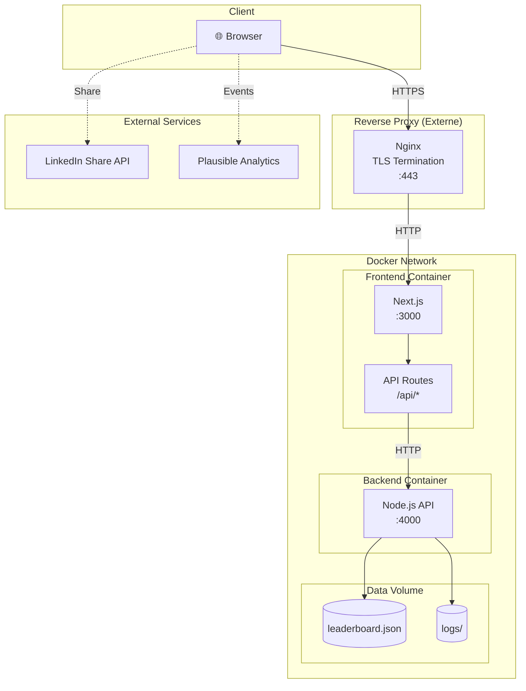
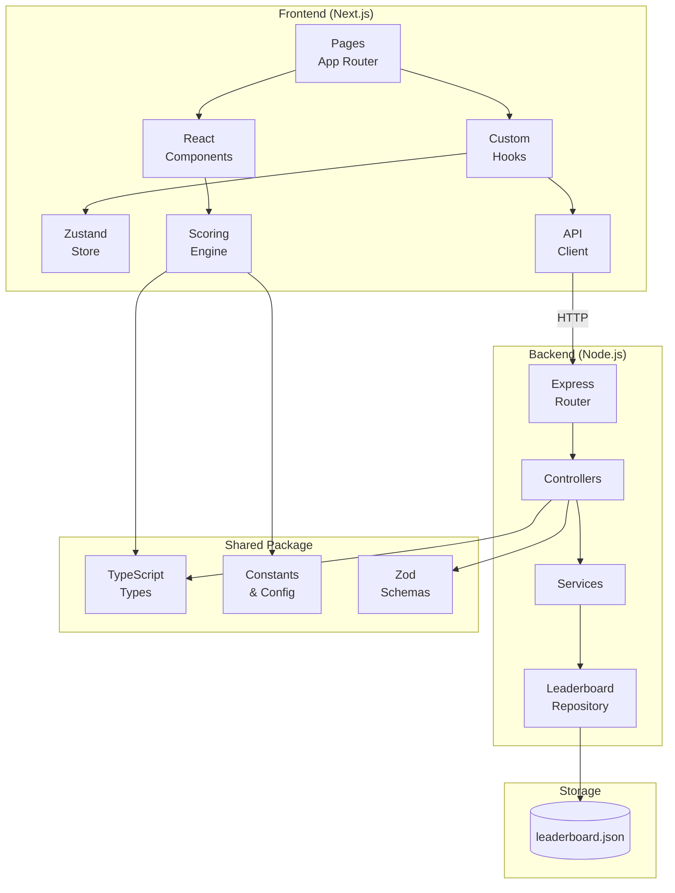
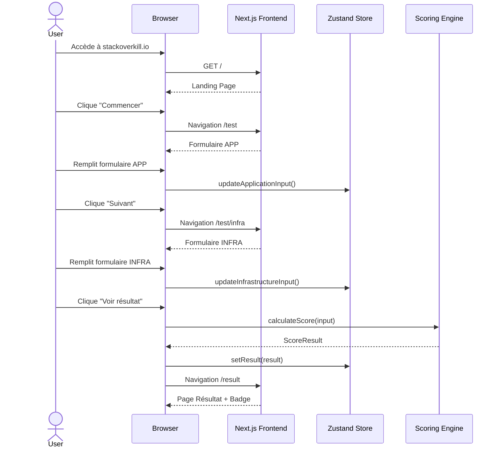
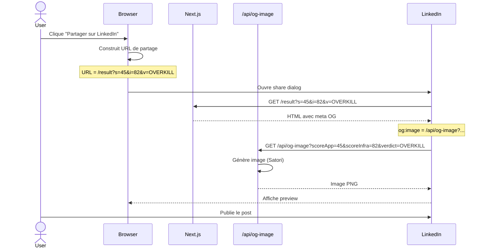
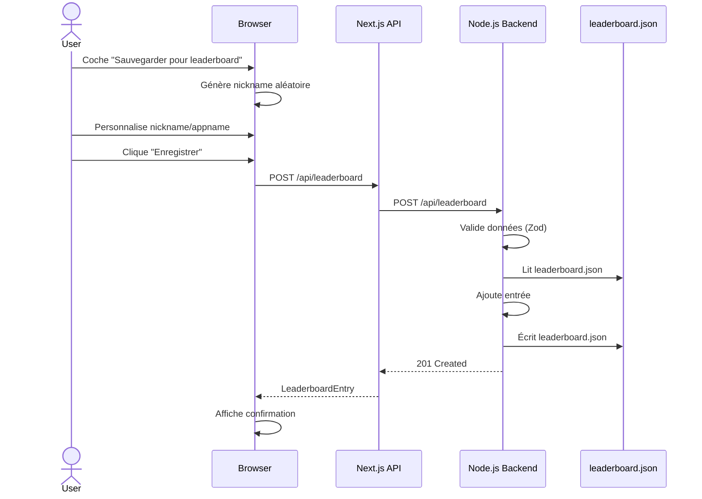

# StackOverkill.io — Fullstack Architecture Document

## Document Info

| Attribut | Valeur |
|----------|--------|
| **Version** | 1.0 |
| **Date** | 2026-01-19 |
| **Auteur** | Winston (Architect) |
| **Statut** | Draft |

---

## Introduction

Ce document définit l'architecture complète de StackOverkill.io, une application web permettant de mesurer l'écart entre la complexité d'une infrastructure IT et les besoins métier réels.

L'architecture est conçue pour :
- **Simplicité** : Monorepo, stack moderne, déploiement conteneurisé
- **Performance** : Next.js SSR/SSG, génération d'images optimisée
- **Viralité** : Open Graph dynamique, partage LinkedIn fluide
- **Maintenabilité** : TypeScript, structure claire, CI/CD automatisé

### Starter Template

**N/A** — Projet greenfield, structure créée from scratch.

### Change Log

| Date | Version | Description | Author |
|------|---------|-------------|--------|
| 2026-01-19 | 1.0 | Création initiale | Winston (Architect) |

---

## High Level Architecture

### Technical Summary

StackOverkill.io est une application web fullstack containerisée, déployée en self-hosted via GitLab CI/CD. Le frontend Next.js gère le rendu SSR pour les meta tags Open Graph et les API Routes pour les fonctionnalités serveur légères. Un backend Node.js séparé est prévu pour anticiper les besoins futurs (leaderboard, analytics avancées). L'ensemble est orchestré via Docker Compose, derrière un reverse proxy Nginx existant qui gère la terminaison TLS. Le stockage est minimal (fichier JSON pour le leaderboard) avec possibilité d'évolution vers une base de données.

### Platform and Infrastructure Choice

**Platform :** Self-hosted (Docker containers)

**Key Services :**
- Next.js (frontend + API routes légères)
- Node.js/Express (backend API)
- Nginx (reverse proxy externe, TLS)
- GitLab CI/CD (déploiement automatisé)
- GitLab Container Registry (images Docker)

**Deployment Host :** Infrastructure self-hosted (VPS/serveur dédié)

### Repository Structure

**Structure :** Monorepo

**Organisation :**
```
StackOverkill/           # Racine du projet (dossier actuel)
├── apps/
│   ├── frontend/        # Next.js application
│   └── backend/         # Node.js API
├── packages/
│   └── shared/          # Types et utilitaires partagés
├── docker/              # Dockerfiles et configs
├── docs/                # Documentation
└── data/                # Données persistantes (gitignored en prod)
```

### High Level Architecture Diagram



### Architectural Patterns

- **JAMstack-inspired Architecture :** Frontend statique avec API serverless-like — *Rationale :* Performance optimale, SEO-friendly, scalabilité
- **Monorepo Pattern :** Code frontend, backend et shared dans un seul repo — *Rationale :* Cohérence des types, atomic commits, simplicité CI/CD
- **Container-based Deployment :** Chaque service dans son conteneur Docker — *Rationale :* Isolation, reproductibilité, portabilité
- **API Gateway Pattern (léger) :** Next.js API Routes comme proxy vers le backend — *Rationale :* Simplification CORS, point d'entrée unique
- **Repository Pattern (backend) :** Abstraction de l'accès aux données — *Rationale :* Facilite la migration future vers une vraie DB
- **Component-Based UI :** Composants React réutilisables avec TypeScript — *Rationale :* Maintenabilité, testabilité

---

## Tech Stack

### Technology Stack Table

| Category | Technology | Version | Purpose | Rationale |
|----------|------------|---------|---------|-----------|
| **Frontend Language** | TypeScript | 5.x | Type safety | Robustesse, DX, refactoring sûr |
| **Frontend Framework** | Next.js | 14.x | SSR/SSG, routing, API routes | OG tags dynamiques, performance, écosystème |
| **UI Component Library** | Tailwind CSS + Headless UI | 3.x / 2.x | Styling, composants accessibles | Rapidité dev, bundle optimisé, a11y |
| **State Management** | Zustand | 4.x | État client léger | Simple, performant, pas de boilerplate |
| **Backend Language** | TypeScript | 5.x | Type safety | Cohérence avec frontend, types partagés |
| **Backend Framework** | Express.js | 4.x | API REST | Mature, simple, large écosystème |
| **API Style** | REST | - | Communication frontend-backend | Simple, bien supporté, suffisant pour le use case |
| **Database** | JSON File (MVP) | - | Stockage leaderboard | Simplicité, pas de DB à gérer pour MVP |
| **Cache** | N/A (MVP) | - | - | Pas nécessaire pour MVP |
| **File Storage** | Docker Volume | - | Persistance données | Simple, intégré Docker |
| **Authentication** | N/A | - | Pas d'auth MVP | Pas de comptes utilisateurs |
| **Frontend Testing** | Vitest + Testing Library | 1.x / 14.x | Tests unitaires composants | Rapide, compatible Vite, API Jest-like |
| **Backend Testing** | Vitest | 1.x | Tests unitaires API | Même outil que frontend, cohérence |
| **E2E Testing** | Playwright | 1.x | Tests end-to-end | Moderne, fiable, multi-navigateurs |
| **Build Tool** | Turbo | 2.x | Monorepo build orchestration | Cache intelligent, builds parallèles |
| **Bundler** | Next.js (Webpack/Turbopack) | - | Bundle frontend | Intégré Next.js |
| **IaC Tool** | Docker Compose | 2.x | Orchestration containers | Simple, suffisant pour single-host |
| **CI/CD** | GitLab CI/CD | - | Pipeline déploiement | Intégré GitLab, gratuit |
| **Monitoring** | Plausible Analytics | - | Analytics privacy-friendly | RGPD compliant, léger |
| **Logging** | Pino | 8.x | Logs structurés JSON | Performant, format JSON pour parsing |
| **CSS Framework** | Tailwind CSS | 3.x | Utility-first CSS | Rapidité, consistance, purge automatique |
| **Image Generation** | @vercel/og (Satori) | 0.6.x | Génération badges OG | Optimisé pour OG images, Edge-compatible |

---

## Data Models

### ScoreInput

**Purpose :** Données saisies par l'utilisateur pour le calcul des scores

**Key Attributes :**
- `application`: ApplicationInput - Données de l'application évaluée
- `infrastructure`: InfrastructureInput - Données de l'infrastructure

#### TypeScript Interface

```typescript
// packages/shared/src/types/score-input.ts

export interface ApplicationInput {
  criticality: 1 | 2 | 3 | 4 | 5;           // Niveau de criticité métier
  userCount: 1 | 2 | 3 | 4 | 5 | 6;         // Plage d'utilisateurs
  financialImpact: 1 | 2 | 3 | 4 | 5 | 6;   // Impact financier mensuel
  availability: 1 | 2 | 3 | 4 | 5 | 6;      // SLA attendu
  exposure: 1 | 2 | 3 | 4 | 5;              // Exposition et conformité
  complexity: 1 | 2 | 3 | 4 | 5;            // Complexité applicative
  dataSensitivity: 1 | 2 | 3 | 4;           // Sensibilité des données
}

export interface InfrastructureInput {
  sophistication: 1 | 2 | 3 | 4 | 5 | 6;    // Stack technique
  resilience: 1 | 2 | 3 | 4 | 5 | 6;        // Niveau de résilience
  monthlyCost: 1 | 2 | 3 | 4 | 5 | 6;       // Budget mensuel
  teamCapacity: 1 | 2 | 3 | 4 | 5 | 6;      // Taille équipe
  operationalMaturity: 1 | 2 | 3 | 4 | 5 | 6; // Maturité ops
  automation: 1 | 2 | 3 | 4 | 5 | 6;        // Niveau automatisation
  securityPosture: 1 | 2 | 3 | 4 | 5;       // Posture sécurité
}

export interface ScoreInput {
  application: ApplicationInput;
  infrastructure: InfrastructureInput;
}
```

### ScoreResult

**Purpose :** Résultat du calcul de scoring

**Key Attributes :**
- `scoreApp`: number - Score application (0-100)
- `scoreInfra`: number - Score infrastructure (0-100)
- `gap`: number - Écart (scoreInfra - scoreApp)
- `verdict`: Verdict - Verdict global

#### TypeScript Interface

```typescript
// packages/shared/src/types/score-result.ts

export type Verdict =
  | 'OVERKILL_SEVERE'
  | 'OVERKILL'
  | 'SLIGHT_OVERKILL'
  | 'BALANCED'
  | 'SLIGHT_UNDERKILL'
  | 'UNDERKILL'
  | 'UNDERKILL_SEVERE';

export type VerdictColor = 'green' | 'yellow' | 'orange' | 'red';

export interface ScoreResult {
  scoreApp: number;           // 0-100
  scoreInfra: number;         // 0-100
  gap: number;                // scoreInfra - scoreApp
  verdict: Verdict;
  verdictColor: VerdictColor;
  explanation: string;        // Message explicatif
  timestamp: string;          // ISO 8601
}
```

### LeaderboardEntry

**Purpose :** Entrée dans le leaderboard (opt-in uniquement)

**Key Attributes :**
- `id`: string - Identifiant unique
- `nickname`: string - Pseudo généré/choisi
- `appname`: string - Nom d'app mock
- `scores`: Scores et verdict

#### TypeScript Interface

```typescript
// packages/shared/src/types/leaderboard.ts

export interface LeaderboardEntry {
  id: string;                 // UUID
  nickname: string;           // Mock nickname
  appname: string;            // Mock app name
  scoreApp: number;
  scoreInfra: number;
  gap: number;
  verdict: Verdict;
  createdAt: string;          // ISO 8601
}

export interface Leaderboard {
  entries: LeaderboardEntry[];
  lastUpdated: string;
}
```

#### Relationships

- ScoreInput → ScoreResult (calcul)
- ScoreResult → LeaderboardEntry (opt-in persistence)

---

## API Specification

### REST API Specification

```yaml
openapi: 3.0.0
info:
  title: StackOverkill API
  version: 1.0.0
  description: API pour le calcul de scores et la gestion du leaderboard

servers:
  - url: /api
    description: API Routes Next.js (frontend)
  - url: http://backend:4000/api
    description: Backend Node.js (interne)

paths:
  /score/calculate:
    post:
      summary: Calcule les scores APP et INFRA
      description: Prend les inputs utilisateur et retourne le résultat complet
      tags: [Score]
      requestBody:
        required: true
        content:
          application/json:
            schema:
              $ref: '#/components/schemas/ScoreInput'
      responses:
        '200':
          description: Scores calculés
          content:
            application/json:
              schema:
                $ref: '#/components/schemas/ScoreResult'
        '400':
          description: Input invalide
          content:
            application/json:
              schema:
                $ref: '#/components/schemas/ApiError'

  /og-image:
    get:
      summary: Génère l'image Open Graph
      description: Génère dynamiquement l'image de partage
      tags: [Image]
      parameters:
        - name: scoreApp
          in: query
          required: true
          schema:
            type: integer
        - name: scoreInfra
          in: query
          required: true
          schema:
            type: integer
        - name: verdict
          in: query
          required: true
          schema:
            type: string
      responses:
        '200':
          description: Image PNG
          content:
            image/png:
              schema:
                type: string
                format: binary

  /leaderboard:
    get:
      summary: Récupère le leaderboard
      tags: [Leaderboard]
      parameters:
        - name: type
          in: query
          schema:
            type: string
            enum: [overkill, underkill, all]
          default: all
        - name: limit
          in: query
          schema:
            type: integer
            default: 10
      responses:
        '200':
          description: Liste des entrées
          content:
            application/json:
              schema:
                type: array
                items:
                  $ref: '#/components/schemas/LeaderboardEntry'

    post:
      summary: Ajoute une entrée au leaderboard
      description: Opt-in uniquement, avec données anonymisées
      tags: [Leaderboard]
      requestBody:
        required: true
        content:
          application/json:
            schema:
              type: object
              required: [nickname, appname, scoreApp, scoreInfra, verdict]
              properties:
                nickname:
                  type: string
                  maxLength: 30
                appname:
                  type: string
                  maxLength: 50
                scoreApp:
                  type: integer
                  minimum: 0
                  maximum: 100
                scoreInfra:
                  type: integer
                  minimum: 0
                  maximum: 100
                verdict:
                  type: string
      responses:
        '201':
          description: Entrée créée
          content:
            application/json:
              schema:
                $ref: '#/components/schemas/LeaderboardEntry'
        '400':
          description: Données invalides

  /health:
    get:
      summary: Health check
      tags: [System]
      responses:
        '200':
          description: Service healthy
          content:
            application/json:
              schema:
                type: object
                properties:
                  status:
                    type: string
                    example: ok
                  timestamp:
                    type: string

components:
  schemas:
    ScoreInput:
      type: object
      required: [application, infrastructure]
      properties:
        application:
          $ref: '#/components/schemas/ApplicationInput'
        infrastructure:
          $ref: '#/components/schemas/InfrastructureInput'

    ApplicationInput:
      type: object
      required: [criticality, userCount, financialImpact, availability, exposure, complexity, dataSensitivity]
      properties:
        criticality:
          type: integer
          minimum: 1
          maximum: 5
        userCount:
          type: integer
          minimum: 1
          maximum: 6
        financialImpact:
          type: integer
          minimum: 1
          maximum: 6
        availability:
          type: integer
          minimum: 1
          maximum: 6
        exposure:
          type: integer
          minimum: 1
          maximum: 5
        complexity:
          type: integer
          minimum: 1
          maximum: 5
        dataSensitivity:
          type: integer
          minimum: 1
          maximum: 4

    InfrastructureInput:
      type: object
      required: [sophistication, resilience, monthlyCost, teamCapacity, operationalMaturity, automation, securityPosture]
      properties:
        sophistication:
          type: integer
          minimum: 1
          maximum: 6
        resilience:
          type: integer
          minimum: 1
          maximum: 6
        monthlyCost:
          type: integer
          minimum: 1
          maximum: 6
        teamCapacity:
          type: integer
          minimum: 1
          maximum: 6
        operationalMaturity:
          type: integer
          minimum: 1
          maximum: 6
        automation:
          type: integer
          minimum: 1
          maximum: 6
        securityPosture:
          type: integer
          minimum: 1
          maximum: 5

    ScoreResult:
      type: object
      properties:
        scoreApp:
          type: integer
        scoreInfra:
          type: integer
        gap:
          type: integer
        verdict:
          type: string
        verdictColor:
          type: string
        explanation:
          type: string
        timestamp:
          type: string
          format: date-time

    LeaderboardEntry:
      type: object
      properties:
        id:
          type: string
          format: uuid
        nickname:
          type: string
        appname:
          type: string
        scoreApp:
          type: integer
        scoreInfra:
          type: integer
        gap:
          type: integer
        verdict:
          type: string
        createdAt:
          type: string
          format: date-time

    ApiError:
      type: object
      properties:
        error:
          type: object
          properties:
            code:
              type: string
            message:
              type: string
            details:
              type: object
            timestamp:
              type: string
            requestId:
              type: string
```

---

## Components

### Frontend Components

#### Next.js Application

**Responsibility :** Interface utilisateur, SSR pour OG tags, API routes proxy

**Key Interfaces :**
- Pages (App Router)
- API Routes (`/api/*`)
- React Components

**Dependencies :** packages/shared (types)

**Technology Stack :** Next.js 14, React 18, Tailwind CSS, Zustand

#### Scoring Engine (Frontend)

**Responsibility :** Calcul des scores côté client (logique pure)

**Key Interfaces :**
- `calculateScore(input: ScoreInput): ScoreResult`
- `getVerdict(gap: number): Verdict`

**Dependencies :** packages/shared (types, constants)

**Technology Stack :** TypeScript pure functions

### Backend Components

#### Express API Server

**Responsibility :** API REST pour leaderboard et fonctionnalités serveur

**Key Interfaces :**
- REST endpoints (`/api/leaderboard`, `/api/health`)
- Middleware (error handling, validation, logging)

**Dependencies :** packages/shared (types)

**Technology Stack :** Express.js, Pino, Zod

#### Leaderboard Repository

**Responsibility :** Persistance et lecture du leaderboard

**Key Interfaces :**
- `getAll(): LeaderboardEntry[]`
- `getTop(type: string, limit: number): LeaderboardEntry[]`
- `add(entry: LeaderboardEntry): void`

**Dependencies :** File system (JSON)

**Technology Stack :** Node.js fs/promises

### Shared Package

#### Types & Constants

**Responsibility :** Types TypeScript et constantes partagés entre frontend et backend

**Key Interfaces :**
- Type definitions
- Scoring constants (weights, thresholds)
- Validation schemas (Zod)

**Dependencies :** None

**Technology Stack :** TypeScript, Zod

### Component Diagram



---

## External APIs

### LinkedIn Share

- **Purpose :** Partage des résultats sur LinkedIn
- **Documentation :** https://learn.microsoft.com/en-us/linkedin/consumer/integrations/self-serve/share-on-linkedin
- **Base URL(s) :** `https://www.linkedin.com/sharing/share-offsite/`
- **Authentication :** Aucune (URL de partage public)
- **Rate Limits :** N/A (redirection navigateur)

**Key Endpoints Used :**
- `GET /sharing/share-offsite/?url={url}` - Ouvre le dialog de partage

**Integration Notes :** Utilisation du share URL standard, pas d'OAuth. L'image OG est récupérée par LinkedIn via les meta tags de la page.

### Plausible Analytics

- **Purpose :** Analytics privacy-friendly
- **Documentation :** https://plausible.io/docs
- **Base URL(s) :** `https://plausible.io/api/event` (ou self-hosted)
- **Authentication :** Domain-based
- **Rate Limits :** Illimité pour events standards

**Key Endpoints Used :**
- `POST /api/event` - Enregistre un événement

**Integration Notes :** Script léger (<1KB), pas de cookies, RGPD compliant by default.

---

## Core Workflows

### Workflow 1: Test Flow (Happy Path)



### Workflow 2: Share on LinkedIn



### Workflow 3: Leaderboard Opt-in



---

## Database Schema

### JSON File Schema (MVP)

Pour le MVP, le stockage est un simple fichier JSON. Structure :

```json
{
  "$schema": "http://json-schema.org/draft-07/schema#",
  "type": "object",
  "required": ["entries", "metadata"],
  "properties": {
    "metadata": {
      "type": "object",
      "properties": {
        "version": { "type": "string" },
        "lastUpdated": { "type": "string", "format": "date-time" },
        "totalEntries": { "type": "integer" }
      }
    },
    "entries": {
      "type": "array",
      "items": {
        "type": "object",
        "required": ["id", "nickname", "appname", "scoreApp", "scoreInfra", "gap", "verdict", "createdAt"],
        "properties": {
          "id": { "type": "string", "format": "uuid" },
          "nickname": { "type": "string", "maxLength": 30 },
          "appname": { "type": "string", "maxLength": 50 },
          "scoreApp": { "type": "integer", "minimum": 0, "maximum": 100 },
          "scoreInfra": { "type": "integer", "minimum": 0, "maximum": 100 },
          "gap": { "type": "integer", "minimum": -100, "maximum": 100 },
          "verdict": {
            "type": "string",
            "enum": ["OVERKILL_SEVERE", "OVERKILL", "SLIGHT_OVERKILL", "BALANCED", "SLIGHT_UNDERKILL", "UNDERKILL", "UNDERKILL_SEVERE"]
          },
          "createdAt": { "type": "string", "format": "date-time" }
        }
      }
    }
  }
}
```

### Exemple de fichier

```json
{
  "metadata": {
    "version": "1.0",
    "lastUpdated": "2026-01-19T15:30:00Z",
    "totalEntries": 2
  },
  "entries": [
    {
      "id": "550e8400-e29b-41d4-a716-446655440000",
      "nickname": "ServerlessSteve",
      "appname": "MonSiteVitrine",
      "scoreApp": 14,
      "scoreInfra": 67,
      "gap": 53,
      "verdict": "OVERKILL_SEVERE",
      "createdAt": "2026-01-19T14:30:00Z"
    },
    {
      "id": "550e8400-e29b-41d4-a716-446655440001",
      "nickname": "K8sKaren",
      "appname": "CriticalEcommerce",
      "scoreApp": 81,
      "scoreInfra": 17,
      "gap": -64,
      "verdict": "UNDERKILL_SEVERE",
      "createdAt": "2026-01-19T15:00:00Z"
    }
  ]
}
```

### Migration future

Si le volume devient important, migration vers :
- **SQLite** : Simple, fichier unique, pas de serveur
- **PostgreSQL** : Si besoin de requêtes complexes ou de scaling

---

## Frontend Architecture

### Component Architecture

#### Component Organization

```
apps/frontend/src/
├── app/                        # Next.js App Router
│   ├── layout.tsx              # Root layout
│   ├── page.tsx                # Landing page
│   ├── test/
│   │   ├── page.tsx            # Formulaire APP
│   │   └── infra/
│   │       └── page.tsx        # Formulaire INFRA
│   ├── result/
│   │   └── page.tsx            # Page résultat
│   ├── leaderboard/
│   │   └── page.tsx            # Leaderboard
│   └── api/
│       ├── og-image/
│       │   └── route.ts        # Génération image OG
│       └── leaderboard/
│           └── route.ts        # Proxy vers backend
├── components/
│   ├── ui/                     # Composants UI génériques
│   │   ├── Button.tsx
│   │   ├── Card.tsx
│   │   ├── Progress.tsx
│   │   ├── Select.tsx
│   │   └── Slider.tsx
│   ├── forms/                  # Composants formulaires
│   │   ├── ApplicationForm.tsx
│   │   ├── InfrastructureForm.tsx
│   │   └── FormField.tsx
│   ├── results/                # Composants résultats
│   │   ├── ScoreDisplay.tsx
│   │   ├── VerdictBadge.tsx
│   │   ├── GapVisualization.tsx
│   │   └── ShareButtons.tsx
│   └── layout/                 # Composants layout
│       ├── Header.tsx
│       ├── Footer.tsx
│       └── Container.tsx
├── hooks/
│   ├── useScoreCalculation.ts
│   ├── useLeaderboard.ts
│   └── useShare.ts
├── stores/
│   └── scoreStore.ts           # Zustand store
├── lib/
│   ├── scoring.ts              # Logique de scoring
│   ├── api.ts                  # API client
│   └── utils.ts                # Utilitaires
└── styles/
    └── globals.css             # Tailwind imports
```

#### Component Template

```typescript
// Exemple: components/results/ScoreDisplay.tsx
'use client';

import { FC } from 'react';
import { motion } from 'framer-motion';
import { ScoreResult } from '@stackoverkill/shared';

interface ScoreDisplayProps {
  result: ScoreResult;
  animate?: boolean;
}

export const ScoreDisplay: FC<ScoreDisplayProps> = ({
  result,
  animate = true
}) => {
  return (
    <div className="flex gap-8 justify-center">
      <ScoreGauge
        label="Application"
        score={result.scoreApp}
        animate={animate}
      />
      <ScoreGauge
        label="Infrastructure"
        score={result.scoreInfra}
        animate={animate}
      />
    </div>
  );
};
```

### State Management Architecture

#### State Structure

```typescript
// stores/scoreStore.ts
import { create } from 'zustand';
import {
  ScoreInput,
  ScoreResult,
  ApplicationInput,
  InfrastructureInput
} from '@stackoverkill/shared';

interface ScoreState {
  // Input state
  applicationInput: Partial<ApplicationInput>;
  infrastructureInput: Partial<InfrastructureInput>;

  // Result state
  result: ScoreResult | null;

  // UI state
  currentStep: 'app' | 'infra' | 'result';
  isCalculating: boolean;

  // Actions
  setApplicationInput: (input: Partial<ApplicationInput>) => void;
  setInfrastructureInput: (input: Partial<InfrastructureInput>) => void;
  calculateScore: () => Promise<void>;
  reset: () => void;
}

export const useScoreStore = create<ScoreState>((set, get) => ({
  applicationInput: {},
  infrastructureInput: {},
  result: null,
  currentStep: 'app',
  isCalculating: false,

  setApplicationInput: (input) =>
    set((state) => ({
      applicationInput: { ...state.applicationInput, ...input }
    })),

  setInfrastructureInput: (input) =>
    set((state) => ({
      infrastructureInput: { ...state.infrastructureInput, ...input }
    })),

  calculateScore: async () => {
    set({ isCalculating: true });
    const { applicationInput, infrastructureInput } = get();

    // Import scoring engine
    const { calculateScore } = await import('@/lib/scoring');
    const result = calculateScore({
      application: applicationInput as ApplicationInput,
      infrastructure: infrastructureInput as InfrastructureInput,
    });

    set({ result, isCalculating: false, currentStep: 'result' });
  },

  reset: () => set({
    applicationInput: {},
    infrastructureInput: {},
    result: null,
    currentStep: 'app',
  }),
}));
```

#### State Management Patterns

- Zustand pour état global (scores, résultats)
- React state local pour UI éphémère (hover, focus)
- URL state pour partage (query params sur /result)
- Pas de persistence locale (données éphémères by design)

### Routing Architecture

#### Route Organization

```
/                           # Landing page
/test                       # Formulaire APPLICATION
/test/infra                 # Formulaire INFRASTRUCTURE
/result                     # Page résultat (avec query params)
/result?s=45&i=82&v=OVERKILL  # Résultat partageable
/leaderboard                # Leaderboard public
/leaderboard?type=overkill  # Filtré
/privacy                    # Politique de confidentialité
/legal                      # Mentions légales
```

#### Protected Route Pattern

```typescript
// Pas de routes protégées (pas d'auth)
// Mais validation des étapes du formulaire :

// middleware.ts (ou dans le composant)
export function validateStep(
  currentStep: 'app' | 'infra' | 'result',
  applicationInput: Partial<ApplicationInput>,
  infrastructureInput: Partial<InfrastructureInput>
): boolean {
  switch (currentStep) {
    case 'infra':
      return isApplicationInputComplete(applicationInput);
    case 'result':
      return isApplicationInputComplete(applicationInput)
          && isInfrastructureInputComplete(infrastructureInput);
    default:
      return true;
  }
}
```

### Frontend Services Layer

#### API Client Setup

```typescript
// lib/api.ts
const API_BASE = process.env.NEXT_PUBLIC_API_URL || '/api';

class ApiClient {
  private baseUrl: string;

  constructor(baseUrl: string) {
    this.baseUrl = baseUrl;
  }

  async get<T>(path: string): Promise<T> {
    const response = await fetch(`${this.baseUrl}${path}`);
    if (!response.ok) {
      throw new ApiError(response);
    }
    return response.json();
  }

  async post<T, D>(path: string, data: D): Promise<T> {
    const response = await fetch(`${this.baseUrl}${path}`, {
      method: 'POST',
      headers: { 'Content-Type': 'application/json' },
      body: JSON.stringify(data),
    });
    if (!response.ok) {
      throw new ApiError(response);
    }
    return response.json();
  }
}

export const api = new ApiClient(API_BASE);
```

#### Service Example

```typescript
// lib/services/leaderboard.ts
import { api } from '../api';
import { LeaderboardEntry } from '@stackoverkill/shared';

export const leaderboardService = {
  async getTop(type: 'overkill' | 'underkill' | 'all' = 'all', limit = 10) {
    return api.get<LeaderboardEntry[]>(
      `/leaderboard?type=${type}&limit=${limit}`
    );
  },

  async addEntry(entry: Omit<LeaderboardEntry, 'id' | 'createdAt'>) {
    return api.post<LeaderboardEntry, typeof entry>('/leaderboard', entry);
  },
};
```

---

## Backend Architecture

### Service Architecture (Node.js)

#### Function Organization

```
apps/backend/src/
├── index.ts                    # Entry point
├── app.ts                      # Express app setup
├── routes/
│   ├── index.ts                # Route aggregator
│   ├── health.routes.ts        # Health check
│   └── leaderboard.routes.ts   # Leaderboard CRUD
├── controllers/
│   ├── health.controller.ts
│   └── leaderboard.controller.ts
├── services/
│   └── leaderboard.service.ts
├── repositories/
│   └── leaderboard.repository.ts
├── middleware/
│   ├── errorHandler.ts
│   ├── requestLogger.ts
│   ├── rateLimiter.ts
│   └── validator.ts
├── utils/
│   ├── logger.ts               # Pino logger
│   └── fileUtils.ts
└── config/
    └── index.ts                # Configuration
```

#### Controller Template

```typescript
// controllers/leaderboard.controller.ts
import { Request, Response, NextFunction } from 'express';
import { leaderboardService } from '../services/leaderboard.service';
import { CreateLeaderboardEntrySchema } from '@stackoverkill/shared';

export const leaderboardController = {
  async getAll(req: Request, res: Response, next: NextFunction) {
    try {
      const { type = 'all', limit = '10' } = req.query;
      const entries = await leaderboardService.getTop(
        type as string,
        parseInt(limit as string)
      );
      res.json(entries);
    } catch (error) {
      next(error);
    }
  },

  async create(req: Request, res: Response, next: NextFunction) {
    try {
      const validated = CreateLeaderboardEntrySchema.parse(req.body);
      const entry = await leaderboardService.addEntry(validated);
      res.status(201).json(entry);
    } catch (error) {
      next(error);
    }
  },
};
```

### Database Architecture

#### Data Access Layer

```typescript
// repositories/leaderboard.repository.ts
import { readFile, writeFile } from 'fs/promises';
import { existsSync } from 'fs';
import path from 'path';
import { Leaderboard, LeaderboardEntry } from '@stackoverkill/shared';
import { logger } from '../utils/logger';

const DATA_PATH = process.env.DATA_PATH || '/data';
const LEADERBOARD_FILE = path.join(DATA_PATH, 'leaderboard.json');

const DEFAULT_LEADERBOARD: Leaderboard = {
  metadata: {
    version: '1.0',
    lastUpdated: new Date().toISOString(),
    totalEntries: 0,
  },
  entries: [],
};

export const leaderboardRepository = {
  async read(): Promise<Leaderboard> {
    try {
      if (!existsSync(LEADERBOARD_FILE)) {
        await this.write(DEFAULT_LEADERBOARD);
        return DEFAULT_LEADERBOARD;
      }
      const data = await readFile(LEADERBOARD_FILE, 'utf-8');
      return JSON.parse(data);
    } catch (error) {
      logger.error({ error }, 'Failed to read leaderboard');
      return DEFAULT_LEADERBOARD;
    }
  },

  async write(data: Leaderboard): Promise<void> {
    data.metadata.lastUpdated = new Date().toISOString();
    data.metadata.totalEntries = data.entries.length;
    await writeFile(LEADERBOARD_FILE, JSON.stringify(data, null, 2));
  },

  async addEntry(entry: LeaderboardEntry): Promise<LeaderboardEntry> {
    const leaderboard = await this.read();
    leaderboard.entries.unshift(entry); // Add at beginning

    // Keep only last 1000 entries
    if (leaderboard.entries.length > 1000) {
      leaderboard.entries = leaderboard.entries.slice(0, 1000);
    }

    await this.write(leaderboard);
    return entry;
  },

  async getTop(
    type: 'overkill' | 'underkill' | 'all',
    limit: number
  ): Promise<LeaderboardEntry[]> {
    const { entries } = await this.read();

    let filtered = entries;
    if (type === 'overkill') {
      filtered = entries.filter(e => e.gap > 0).sort((a, b) => b.gap - a.gap);
    } else if (type === 'underkill') {
      filtered = entries.filter(e => e.gap < 0).sort((a, b) => a.gap - b.gap);
    }

    return filtered.slice(0, limit);
  },
};
```

### Authentication and Authorization

**N/A pour le MVP** — Pas d'authentification utilisateur.

Seules protections :
- Rate limiting sur les endpoints d'écriture
- Validation des données entrantes (Zod)
- CORS configuré

---

## Unified Project Structure

```
StackOverkill/
├── .gitlab-ci.yml              # Pipeline CI/CD GitLab
├── .gitignore
├── .env.example                # Template variables d'environnement
├── docker-compose.yml          # Orchestration développement
├── docker-compose.prod.yml     # Overrides production
├── turbo.json                  # Configuration Turborepo
├── package.json                # Root package.json (workspaces)
├── pnpm-workspace.yaml         # Configuration pnpm workspaces
│
├── apps/
│   ├── frontend/
│   │   ├── Dockerfile          # Multi-stage build Next.js
│   │   ├── next.config.js
│   │   ├── tailwind.config.js
│   │   ├── tsconfig.json
│   │   ├── package.json
│   │   ├── public/
│   │   │   ├── favicon.ico
│   │   │   └── images/
│   │   └── src/
│   │       ├── app/            # Next.js App Router
│   │       ├── components/
│   │       ├── hooks/
│   │       ├── stores/
│   │       ├── lib/
│   │       └── styles/
│   │
│   └── backend/
│       ├── Dockerfile          # Multi-stage build Node.js
│       ├── tsconfig.json
│       ├── package.json
│       └── src/
│           ├── index.ts
│           ├── app.ts
│           ├── routes/
│           ├── controllers/
│           ├── services/
│           ├── repositories/
│           ├── middleware/
│           ├── utils/
│           └── config/
│
├── packages/
│   └── shared/
│       ├── package.json
│       ├── tsconfig.json
│       └── src/
│           ├── index.ts        # Barrel export
│           ├── types/
│           │   ├── score-input.ts
│           │   ├── score-result.ts
│           │   └── leaderboard.ts
│           ├── constants/
│           │   └── scoring.ts  # Weights, thresholds
│           ├── schemas/
│           │   └── validation.ts # Zod schemas
│           └── utils/
│               └── scoring.ts  # Pure scoring functions
│
├── docker/
│   ├── nginx/
│   │   └── default.conf        # Config Nginx (si utilisé en local)
│   └── scripts/
│       └── init-data.sh        # Initialisation données
│
├── data/                       # Volume Docker (gitignored en prod)
│   └── leaderboard.json
│
├── docs/
│   ├── brief.md
│   ├── prd.md
│   ├── scoring-methodology.md
│   └── architecture.md
│
└── README.md
```

---

## Development Workflow

### Local Development Setup

#### Prerequisites

```bash
# Node.js 20+ requis
node --version  # v20.x.x

# pnpm (gestionnaire de paquets recommandé)
npm install -g pnpm

# Docker & Docker Compose
docker --version
docker compose version
```

#### Initial Setup

```bash
# Cloner le repo
git clone git@gitlab.com:username/stackoverkill.git
cd stackoverkill

# Installer les dépendances
pnpm install

# Copier les variables d'environnement
cp .env.example .env.local
cp apps/frontend/.env.example apps/frontend/.env.local
cp apps/backend/.env.example apps/backend/.env.local

# Initialiser les données
mkdir -p data
echo '{"metadata":{"version":"1.0","lastUpdated":"","totalEntries":0},"entries":[]}' > data/leaderboard.json
```

#### Development Commands

```bash
# Démarrer tous les services (dev mode)
pnpm dev

# Démarrer frontend uniquement
pnpm dev --filter=frontend

# Démarrer backend uniquement
pnpm dev --filter=backend

# Build tous les packages
pnpm build

# Lancer les tests
pnpm test

# Lancer les tests en watch mode
pnpm test:watch

# Linter
pnpm lint

# Type check
pnpm typecheck

# Docker local (simule prod)
docker compose up --build
```

### Environment Configuration

#### Required Environment Variables

```bash
# apps/frontend/.env.local
NEXT_PUBLIC_API_URL=http://localhost:4000/api
NEXT_PUBLIC_SITE_URL=http://localhost:3000
NEXT_PUBLIC_PLAUSIBLE_DOMAIN=stackoverkill.io

# apps/backend/.env.local
PORT=4000
NODE_ENV=development
DATA_PATH=../../data
LOG_LEVEL=debug
CORS_ORIGIN=http://localhost:3000

# Production (.env.production)
NEXT_PUBLIC_API_URL=https://api.stackoverkill.io/api
NEXT_PUBLIC_SITE_URL=https://stackoverkill.io
```

---

## Deployment Architecture

### Deployment Strategy

**Frontend Deployment:**
- **Platform :** Docker container (self-hosted)
- **Build Command :** `pnpm build --filter=frontend`
- **Output Directory :** `apps/frontend/.next/standalone`
- **Port :** 3000

**Backend Deployment:**
- **Platform :** Docker container (self-hosted)
- **Build Command :** `pnpm build --filter=backend`
- **Output Directory :** `apps/backend/dist`
- **Port :** 4000

### Dockerfiles

#### Frontend Dockerfile

```dockerfile
# apps/frontend/Dockerfile
FROM node:20-alpine AS base

# Install pnpm
RUN corepack enable && corepack prepare pnpm@latest --activate

# Dependencies stage
FROM base AS deps
WORKDIR /app

COPY package.json pnpm-lock.yaml pnpm-workspace.yaml ./
COPY apps/frontend/package.json ./apps/frontend/
COPY packages/shared/package.json ./packages/shared/

RUN pnpm install --frozen-lockfile

# Builder stage
FROM base AS builder
WORKDIR /app

COPY --from=deps /app/node_modules ./node_modules
COPY --from=deps /app/apps/frontend/node_modules ./apps/frontend/node_modules
COPY --from=deps /app/packages/shared/node_modules ./packages/shared/node_modules

COPY . .

ENV NEXT_TELEMETRY_DISABLED=1
RUN pnpm build --filter=frontend

# Runner stage
FROM base AS runner
WORKDIR /app

ENV NODE_ENV=production
ENV NEXT_TELEMETRY_DISABLED=1

RUN addgroup --system --gid 1001 nodejs
RUN adduser --system --uid 1001 nextjs

COPY --from=builder /app/apps/frontend/public ./public
COPY --from=builder --chown=nextjs:nodejs /app/apps/frontend/.next/standalone ./
COPY --from=builder --chown=nextjs:nodejs /app/apps/frontend/.next/static ./.next/static

USER nextjs

EXPOSE 3000
ENV PORT=3000
ENV HOSTNAME="0.0.0.0"

CMD ["node", "server.js"]
```

#### Backend Dockerfile

```dockerfile
# apps/backend/Dockerfile
FROM node:20-alpine AS base

RUN corepack enable && corepack prepare pnpm@latest --activate

# Dependencies stage
FROM base AS deps
WORKDIR /app

COPY package.json pnpm-lock.yaml pnpm-workspace.yaml ./
COPY apps/backend/package.json ./apps/backend/
COPY packages/shared/package.json ./packages/shared/

RUN pnpm install --frozen-lockfile --prod

# Builder stage
FROM base AS builder
WORKDIR /app

COPY package.json pnpm-lock.yaml pnpm-workspace.yaml ./
COPY apps/backend/package.json ./apps/backend/
COPY packages/shared/package.json ./packages/shared/

RUN pnpm install --frozen-lockfile

COPY . .
RUN pnpm build --filter=backend

# Runner stage
FROM node:20-alpine AS runner
WORKDIR /app

ENV NODE_ENV=production

RUN addgroup --system --gid 1001 nodejs
RUN adduser --system --uid 1001 expressjs

COPY --from=deps /app/node_modules ./node_modules
COPY --from=builder /app/apps/backend/dist ./dist
COPY --from=builder /app/packages/shared/dist ./packages/shared/dist

USER expressjs

EXPOSE 4000
ENV PORT=4000

CMD ["node", "dist/index.js"]
```

### Docker Compose

#### docker-compose.yml (Development)

```yaml
version: '3.8'

services:
  frontend:
    build:
      context: .
      dockerfile: apps/frontend/Dockerfile
    ports:
      - "3000:3000"
    environment:
      - NEXT_PUBLIC_API_URL=http://backend:4000/api
      - NEXT_PUBLIC_SITE_URL=http://localhost:3000
    depends_on:
      - backend
    networks:
      - stackoverkill

  backend:
    build:
      context: .
      dockerfile: apps/backend/Dockerfile
    ports:
      - "4000:4000"
    environment:
      - NODE_ENV=production
      - PORT=4000
      - DATA_PATH=/data
      - CORS_ORIGIN=http://localhost:3000
    volumes:
      - ./data:/data
    networks:
      - stackoverkill

networks:
  stackoverkill:
    driver: bridge
```

#### docker-compose.prod.yml

```yaml
version: '3.8'

services:
  frontend:
    image: ${CI_REGISTRY_IMAGE}/frontend:${CI_COMMIT_SHA:-latest}
    restart: unless-stopped
    environment:
      - NEXT_PUBLIC_API_URL=https://api.stackoverkill.io/api
      - NEXT_PUBLIC_SITE_URL=https://stackoverkill.io

  backend:
    image: ${CI_REGISTRY_IMAGE}/backend:${CI_COMMIT_SHA:-latest}
    restart: unless-stopped
    environment:
      - NODE_ENV=production
      - CORS_ORIGIN=https://stackoverkill.io
    volumes:
      - stackoverkill-data:/data

volumes:
  stackoverkill-data:
```

### CI/CD Pipeline

```yaml
# .gitlab-ci.yml
stages:
  - test
  - build
  - deploy

variables:
  DOCKER_TLS_CERTDIR: "/certs"

# Cache pnpm
.pnpm-cache:
  cache:
    key: pnpm-$CI_COMMIT_REF_SLUG
    paths:
      - .pnpm-store/

# Test stage
test:
  stage: test
  image: node:20-alpine
  extends: .pnpm-cache
  before_script:
    - corepack enable
    - pnpm config set store-dir .pnpm-store
    - pnpm install --frozen-lockfile
  script:
    - pnpm lint
    - pnpm typecheck
    - pnpm test
  rules:
    - if: $CI_PIPELINE_SOURCE == "merge_request_event"
    - if: $CI_COMMIT_BRANCH == "main"

# Build images
build-frontend:
  stage: build
  image: docker:24
  services:
    - docker:24-dind
  before_script:
    - docker login -u $CI_REGISTRY_USER -p $CI_REGISTRY_PASSWORD $CI_REGISTRY
  script:
    - docker build -t $CI_REGISTRY_IMAGE/frontend:$CI_COMMIT_SHA -f apps/frontend/Dockerfile .
    - docker push $CI_REGISTRY_IMAGE/frontend:$CI_COMMIT_SHA
    - |
      if [ "$CI_COMMIT_BRANCH" == "main" ]; then
        docker tag $CI_REGISTRY_IMAGE/frontend:$CI_COMMIT_SHA $CI_REGISTRY_IMAGE/frontend:latest
        docker push $CI_REGISTRY_IMAGE/frontend:latest
      fi
  rules:
    - if: $CI_COMMIT_BRANCH == "main"

build-backend:
  stage: build
  image: docker:24
  services:
    - docker:24-dind
  before_script:
    - docker login -u $CI_REGISTRY_USER -p $CI_REGISTRY_PASSWORD $CI_REGISTRY
  script:
    - docker build -t $CI_REGISTRY_IMAGE/backend:$CI_COMMIT_SHA -f apps/backend/Dockerfile .
    - docker push $CI_REGISTRY_IMAGE/backend:$CI_COMMIT_SHA
    - |
      if [ "$CI_COMMIT_BRANCH" == "main" ]; then
        docker tag $CI_REGISTRY_IMAGE/backend:$CI_COMMIT_SHA $CI_REGISTRY_IMAGE/backend:latest
        docker push $CI_REGISTRY_IMAGE/backend:latest
      fi
  rules:
    - if: $CI_COMMIT_BRANCH == "main"

# Deploy to production
deploy-production:
  stage: deploy
  image: alpine:latest
  before_script:
    - apk add --no-cache openssh-client
    - eval $(ssh-agent -s)
    - echo "$SSH_PRIVATE_KEY" | tr -d '\r' | ssh-add -
    - mkdir -p ~/.ssh
    - chmod 700 ~/.ssh
    - echo "$SSH_KNOWN_HOSTS" >> ~/.ssh/known_hosts
  script:
    - |
      ssh $DEPLOY_USER@$DEPLOY_HOST << 'EOF'
        cd /opt/stackoverkill
        docker login -u $CI_REGISTRY_USER -p $CI_REGISTRY_PASSWORD $CI_REGISTRY
        docker compose -f docker-compose.yml -f docker-compose.prod.yml pull
        docker compose -f docker-compose.yml -f docker-compose.prod.yml up -d
        docker system prune -f
      EOF
  environment:
    name: production
    url: https://stackoverkill.io
  rules:
    - if: $CI_COMMIT_BRANCH == "main"
      when: manual
```

### Environments

| Environment | Frontend URL | Backend URL | Purpose |
|-------------|--------------|-------------|---------|
| Development | http://localhost:3000 | http://localhost:4000 | Local development |
| Production | https://stackoverkill.io | https://api.stackoverkill.io | Live environment |

---

## Security and Performance

### Security Requirements

**Frontend Security:**
- CSP Headers : `default-src 'self'; script-src 'self' 'unsafe-inline' https://plausible.io; style-src 'self' 'unsafe-inline'; img-src 'self' data: https:;`
- XSS Prevention : React échappe par défaut, pas de `dangerouslySetInnerHTML`
- Secure Storage : Pas de stockage sensible (pas d'auth)

**Backend Security:**
- Input Validation : Zod schemas sur tous les endpoints
- Rate Limiting : 100 req/min par IP sur `/api/leaderboard` POST
- CORS Policy : Whitelist du domaine frontend uniquement

**General Security:**
- HTTPS only (via Nginx reverse proxy)
- No sensitive data stored
- Dependencies audit : `pnpm audit` dans CI

### Performance Optimization

**Frontend Performance:**
- Bundle Size Target : < 100KB gzipped (initial load)
- Loading Strategy :
  - SSG pour landing page
  - Client-side pour formulaire interactif
  - ISR pour leaderboard (revalidate: 60s)
- Caching Strategy :
  - Static assets : 1 year
  - HTML : no-cache
  - API : no-store

**Backend Performance:**
- Response Time Target : < 100ms (p95)
- Database Optimization : JSON file en mémoire avec lazy write
- Caching Strategy : Read-through cache pour leaderboard

---

## Testing Strategy

### Testing Pyramid

```
        E2E Tests (Playwright)
       /                      \
      /   Few critical paths   \
     /_________________________ \
    /                           \
   /    Integration Tests        \
  /   (API routes, services)      \
 /________________________________ \
/                                   \
/         Unit Tests                 \
/   (Scoring, components, utils)      \
/_____________________________________\
```

### Test Organization

#### Frontend Tests

```
apps/frontend/
├── __tests__/
│   ├── components/
│   │   ├── ScoreDisplay.test.tsx
│   │   └── VerdictBadge.test.tsx
│   ├── hooks/
│   │   └── useScoreCalculation.test.ts
│   └── lib/
│       └── scoring.test.ts
└── e2e/
    ├── happy-path.spec.ts
    └── share.spec.ts
```

#### Backend Tests

```
apps/backend/
└── __tests__/
    ├── routes/
    │   └── leaderboard.test.ts
    ├── services/
    │   └── leaderboard.service.test.ts
    └── repositories/
        └── leaderboard.repository.test.ts
```

### Test Examples

#### Frontend Component Test

```typescript
// apps/frontend/__tests__/components/VerdictBadge.test.tsx
import { render, screen } from '@testing-library/react';
import { VerdictBadge } from '@/components/results/VerdictBadge';

describe('VerdictBadge', () => {
  it('renders OVERKILL verdict with correct styling', () => {
    render(<VerdictBadge verdict="OVERKILL" />);

    expect(screen.getByText('OVERKILL')).toBeInTheDocument();
    expect(screen.getByTestId('verdict-badge')).toHaveClass('bg-orange-500');
  });

  it('renders BALANCED verdict with green styling', () => {
    render(<VerdictBadge verdict="BALANCED" />);

    expect(screen.getByText('ÉQUILIBRÉ')).toBeInTheDocument();
    expect(screen.getByTestId('verdict-badge')).toHaveClass('bg-green-500');
  });
});
```

#### Backend API Test

```typescript
// apps/backend/__tests__/routes/leaderboard.test.ts
import request from 'supertest';
import { app } from '../../src/app';

describe('POST /api/leaderboard', () => {
  it('creates a new entry with valid data', async () => {
    const entry = {
      nickname: 'TestUser',
      appname: 'TestApp',
      scoreApp: 50,
      scoreInfra: 75,
      verdict: 'OVERKILL',
    };

    const response = await request(app)
      .post('/api/leaderboard')
      .send(entry)
      .expect(201);

    expect(response.body).toMatchObject({
      nickname: 'TestUser',
      appname: 'TestApp',
      scoreApp: 50,
      scoreInfra: 75,
      gap: 25,
    });
    expect(response.body.id).toBeDefined();
  });

  it('rejects invalid data', async () => {
    const response = await request(app)
      .post('/api/leaderboard')
      .send({ nickname: '' })
      .expect(400);

    expect(response.body.error).toBeDefined();
  });
});
```

#### E2E Test

```typescript
// apps/frontend/e2e/happy-path.spec.ts
import { test, expect } from '@playwright/test';

test.describe('Score calculation flow', () => {
  test('completes full test and shows result', async ({ page }) => {
    await page.goto('/');

    // Landing
    await expect(page.getByText('Ton infra est-elle overkill')).toBeVisible();
    await page.getByRole('button', { name: /commencer/i }).click();

    // Application form
    await page.getByLabel(/criticité/i).selectOption('3');
    await page.getByLabel(/utilisateurs/i).selectOption('4');
    // ... fill other fields
    await page.getByRole('button', { name: /suivant/i }).click();

    // Infrastructure form
    await page.getByLabel(/hébergement/i).selectOption('3');
    // ... fill other fields
    await page.getByRole('button', { name: /voir.*résultat/i }).click();

    // Result page
    await expect(page.getByTestId('score-app')).toBeVisible();
    await expect(page.getByTestId('score-infra')).toBeVisible();
    await expect(page.getByTestId('verdict-badge')).toBeVisible();
  });
});
```

---

## Coding Standards

### Critical Fullstack Rules

- **Type Sharing :** Toujours définir les types dans `packages/shared` et importer depuis là
- **API Calls :** Ne jamais faire d'appels HTTP directs - utiliser la couche service (`lib/api.ts`)
- **Environment Variables :** Accéder uniquement via les objets de config, jamais `process.env` directement dans le code métier
- **Error Handling :** Toutes les routes API doivent utiliser le middleware d'erreur standard
- **Validation :** Valider les inputs avec Zod côté backend, côté frontend pour UX
- **Logging :** Utiliser le logger Pino, jamais `console.log` en production
- **Imports :** Utiliser les alias de chemin (`@/components`, `@stackoverkill/shared`)

### Naming Conventions

| Element | Frontend | Backend | Example |
|---------|----------|---------|---------|
| Components | PascalCase | - | `UserProfile.tsx` |
| Hooks | camelCase with 'use' | - | `useAuth.ts` |
| API Routes | - | kebab-case | `/api/og-image` |
| Files (general) | kebab-case | kebab-case | `score-input.ts` |
| Types/Interfaces | PascalCase | PascalCase | `ScoreResult` |
| Constants | SCREAMING_SNAKE | SCREAMING_SNAKE | `MAX_ENTRIES` |
| Functions | camelCase | camelCase | `calculateScore` |

---

## Error Handling Strategy

### Error Response Format

```typescript
interface ApiError {
  error: {
    code: string;           // Ex: 'VALIDATION_ERROR', 'NOT_FOUND'
    message: string;        // Message humainement lisible
    details?: Record<string, any>;  // Détails additionnels
    timestamp: string;      // ISO 8601
    requestId: string;      // Pour debug/support
  };
}
```

### Frontend Error Handling

```typescript
// lib/errors.ts
export class ApiError extends Error {
  constructor(
    public code: string,
    public message: string,
    public details?: Record<string, any>
  ) {
    super(message);
    this.name = 'ApiError';
  }
}

// hooks/useApiError.ts
export function useApiError() {
  const [error, setError] = useState<ApiError | null>(null);

  const handleError = useCallback((err: unknown) => {
    if (err instanceof ApiError) {
      setError(err);
      // Toast notification
      toast.error(err.message);
    } else {
      setError(new ApiError('UNKNOWN', 'Une erreur est survenue'));
      toast.error('Une erreur est survenue');
    }
  }, []);

  return { error, handleError, clearError: () => setError(null) };
}
```

### Backend Error Handling

```typescript
// middleware/errorHandler.ts
import { Request, Response, NextFunction } from 'express';
import { ZodError } from 'zod';
import { logger } from '../utils/logger';
import { v4 as uuid } from 'uuid';

export function errorHandler(
  err: Error,
  req: Request,
  res: Response,
  next: NextFunction
) {
  const requestId = uuid();

  logger.error({
    err,
    requestId,
    path: req.path,
    method: req.method
  }, 'Request error');

  if (err instanceof ZodError) {
    return res.status(400).json({
      error: {
        code: 'VALIDATION_ERROR',
        message: 'Invalid input data',
        details: err.flatten(),
        timestamp: new Date().toISOString(),
        requestId,
      },
    });
  }

  // Default error
  res.status(500).json({
    error: {
      code: 'INTERNAL_ERROR',
      message: 'An unexpected error occurred',
      timestamp: new Date().toISOString(),
      requestId,
    },
  });
}
```

---

## Monitoring and Observability

### Monitoring Stack

- **Frontend Monitoring :** Plausible Analytics (page views, events)
- **Backend Monitoring :** Pino logs (structured JSON) + healthcheck endpoint
- **Error Tracking :** Logs structurés (pas de service externe pour MVP)
- **Performance Monitoring :** Web Vitals (via Plausible ou Vercel Analytics)

### Key Metrics

**Frontend Metrics:**
- Core Web Vitals (LCP, FID, CLS)
- JavaScript errors (console)
- Custom events : test_started, test_completed, share_clicked, leaderboard_optIn

**Backend Metrics:**
- Request rate (logs)
- Error rate (logs)
- Response time (logs)
- Leaderboard entries count

### Health Check

```typescript
// Endpoint: GET /api/health
{
  "status": "ok",
  "timestamp": "2026-01-19T15:30:00Z",
  "version": "1.0.0",
  "checks": {
    "leaderboard": "ok"
  }
}
```

---

## Checklist Results Report

*À compléter après exécution de la checklist architect*

---

*Document généré le 2026-01-19 — BMAD-METHOD*
