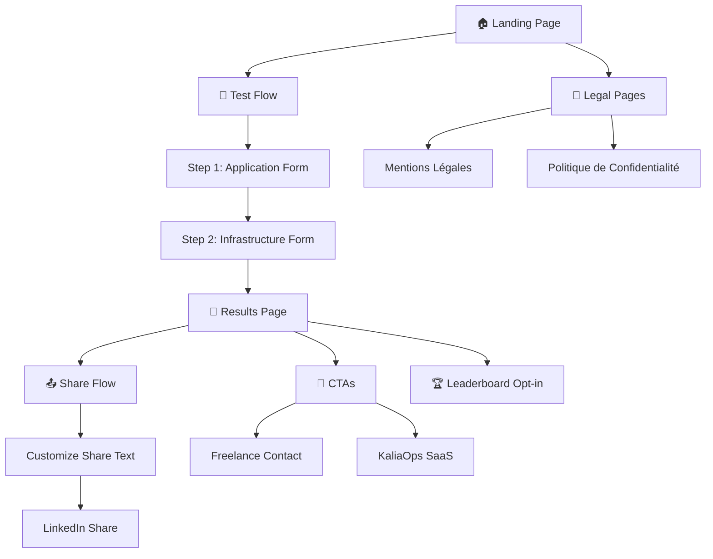
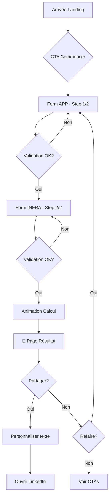
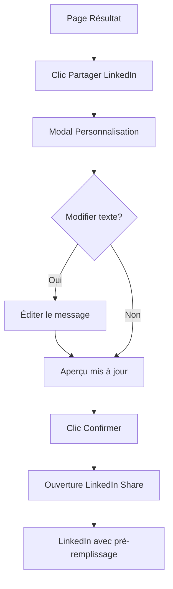
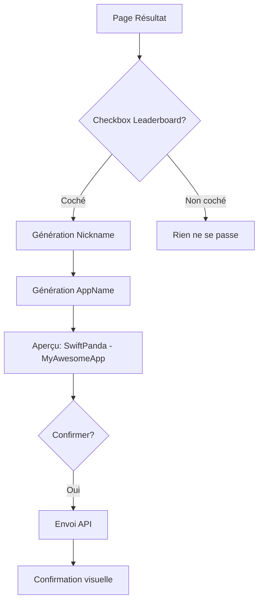

# StackOverkill.io UI/UX Specification

---

## Introduction

This document defines the user experience goals, information architecture, user flows, and visual design specifications for **StackOverkill.io**'s user interface. It serves as the foundation for visual design and frontend development, ensuring a cohesive and user-centered experience.

### Overall UX Goals & Principles

#### Target User Personas

| Persona | Description | Besoins clés | Motivation partage |
|---------|-------------|--------------|-------------------|
| **Le Tech Lead Curieux** | Responsable technique (30-45 ans), gère une équipe de 2-10 devs, veut un diagnostic rapide pour valider ses intuitions | Rapidité, crédibilité du résultat, partage facile | "Regardez, j'avais raison !" |
| **Le DevOps Solo** | Admin système ou DevOps freelance/PME, souvent seul à gérer l'infra, se demande s'il fait "trop" ou "pas assez" | Validation de ses choix, benchmark implicite | "Je suis pas fou, c'est vraiment overkill" |
| **Le Manager Non-Tech** | Directeur de projet ou CTO non-technique qui veut un indicateur simple | Simplicité, visualisation claire, langage accessible | "Je comprends la tech moi aussi" |

#### Usability Goals

1. **Complétion en < 5 minutes** — L'utilisateur termine le test sans friction ni abandon
2. **Compréhension immédiate** — Le résultat est compris en < 10 secondes (visuel prime sur texte)
3. **Envie de partager** — Le "wow moment" déclenche le réflexe de partage LinkedIn
4. **Zéro apprentissage** — Aucune explication nécessaire, le parcours est auto-explicatif
5. **Confiance** — L'utilisateur sent que le diagnostic est crédible, pas un gadget

#### Design Principles

1. **Fun first, serious second** — Le ton est décalé mais la valeur est réelle
2. **Progressive revelation** — Une question à la fois, pas de formulaire intimidant
3. **Instant gratification** — Chaque action donne un feedback immédiat (micro-animations)
4. **Share-worthy results** — Le résultat est conçu pour être screenshot/partagé
5. **Mobile-native** — Conçu pour le pouce, adapté au desktop (pas l'inverse)

### Change Log

| Date | Version | Description | Author |
|------|---------|-------------|--------|
| 2026-01-20 | 1.0 | Création initiale | Sally (UX Expert) |

---

## Information Architecture (IA)

### Site Map / Screen Inventory



### Navigation Structure

**Primary Navigation:** Minimaliste — Header avec logo uniquement pendant le test. Pas de menu de navigation pour éviter les distractions et maximiser la conversion du funnel.

**Secondary Navigation:** Footer persistant avec liens légaux (Mentions légales, Confidentialité). Discret mais accessible.

**Breadcrumb Strategy:** Pas de breadcrumbs traditionnels. Utilisation d'une **barre de progression** visuelle indiquant l'étape actuelle (1/2 ou 2/2) qui sert de repère spatial.

**Navigation Flow:**
- Landing → Test : CTA unique "Commencer"
- Test Step 1 → Step 2 : Bouton "Suivant" (pas de retour visible par défaut)
- Test Step 2 → Results : Bouton "Voir mon résultat"
- Results → Anywhere : Boutons "Refaire" et "Partager"

---

## User Flows

### Flow 1: Parcours Principal (Test Complet)

**User Goal:** Obtenir un diagnostic de l'adéquation infra/besoins en moins de 5 minutes

**Entry Points:**
- Lien direct (stackoverkill.io)
- Partage LinkedIn d'un ami
- Recherche Google

**Success Criteria:**
- L'utilisateur voit son résultat
- L'utilisateur comprend son verdict
- L'utilisateur est tenté de partager



**Edge Cases & Error Handling:**
- Refresh en cours de test → Données perdues, retour au début (acceptable pour MVP)
- Erreur réseau au calcul → Message "Oups, réessayez" avec bouton retry
- Champs invalides → Highlight rouge + message inline, pas de popup

**Notes:** Le parcours est volontairement linéaire (pas de retour arrière visible) pour maximiser la complétion. L'utilisateur peut utiliser le bouton back du navigateur si vraiment nécessaire.

---

### Flow 2: Partage LinkedIn

**User Goal:** Partager son résultat avec son réseau professionnel

**Entry Points:** Bouton "Partager sur LinkedIn" sur la page résultat

**Success Criteria:**
- Le post LinkedIn s'ouvre pré-rempli
- L'image de preview (OG) s'affiche correctement
- Le lien ramène vers StackOverkill



**Edge Cases & Error Handling:**
- LinkedIn non accessible → Fallback vers copie du lien dans le presse-papier
- Image OG non générée → Image statique de fallback
- Texte trop long → Compteur de caractères + troncature auto

---

### Flow 3: Opt-in Leaderboard

**User Goal:** Apparaître dans le leaderboard de façon anonyme

**Entry Points:** Checkbox sur la page résultat

**Success Criteria:**
- Nickname et appname générés automatiquement
- Entrée visible dans le leaderboard
- Données anonymisées



**Edge Cases & Error Handling:**
- Erreur API → Message discret, pas bloquant pour l'expérience
- Double soumission → Idempotence côté serveur

---

## Wireframes & Mockups

**Primary Design Files:** À créer dans Figma (ou via génération AI avec v0/Lovable)

### Key Screen Layouts

#### Screen 1: Landing Page

**Purpose:** Accrocher l'utilisateur et le convertir en testeur

**Key Elements:**
- Hero headline accrocheur : "Ton infra est-elle OVERKILL ?" (grande typo, centered)
- Sous-titre explicatif (1 ligne max)
- CTA proéminent "Commencer le test" (bouton large, couleur accent)
- Indication temps "~2 min" (badge discret)
- Illustration/animation fun (optionnel mais recommandé)

**Layout (Mobile-first):**
```
┌─────────────────────────┐
│ [Logo]                  │
├─────────────────────────┤
│                         │
│   🚀 Illustration       │
│                         │
│  TON INFRA EST-ELLE     │
│     OVERKILL ?          │
│                         │
│  Découvre en 2 min si   │
│  ta stack est adaptée   │
│  à tes vrais besoins    │
│                         │
│  ┌─────────────────┐    │
│  │ COMMENCER LE TEST│    │
│  └─────────────────┘    │
│       ~2 minutes        │
│                         │
├─────────────────────────┤
│ Mentions | Confidentialité│
└─────────────────────────┘
```

**Interaction Notes:**
- Le CTA doit avoir un hover state satisfaisant
- Animation subtile sur l'illustration pour capter l'attention
- Scroll minimal (idéalement tout visible sans scroll sur mobile)

---

#### Screen 2: Form APP (Step 1/2)

**Purpose:** Collecter les données sur l'application de façon engageante

**Key Elements:**
- Progress bar "Étape 1/2 - Ton application"
- Questions présentées une par une (ou par petits groupes)
- Options de réponse visuelles (cards cliquables > radio buttons)
- Feedback visuel immédiat à la sélection
- Bouton "Suivant" (disabled tant que incomplet)

**Layout (Mobile-first):**
```
┌─────────────────────────┐
│ [Logo]     Étape 1/2    │
│ ████████░░░░░░░░░░░░░░  │
├─────────────────────────┤
│                         │
│  TON APPLICATION        │
│                         │
│  Quelle est la          │
│  criticité métier ?     │
│                         │
│  ┌─────────────────┐    │
│  │ 😴 Très faible  │    │
│  └─────────────────┘    │
│  ┌─────────────────┐    │
│  │ 😐 Faible       │    │
│  └─────────────────┘    │
│  ┌─────────────────┐    │
│  │ 😊 Moyenne      │ ✓  │
│  └─────────────────┘    │
│  ┌─────────────────┐    │
│  │ 😤 Haute        │    │
│  └─────────────────┘    │
│  ┌─────────────────┐    │
│  │ 🔥 Critique     │    │
│  └─────────────────┘    │
│                         │
│  ┌─────────────────┐    │
│  │    SUIVANT →    │    │
│  └─────────────────┘    │
└─────────────────────────┘
```

**Interaction Notes:**
- Les cards ont un état hover/focus visible
- La sélection déclenche une micro-animation (scale + check)
- Transition fluide entre les questions (slide ou fade)
- Le bouton "Suivant" s'anime quand il devient actif

---

#### Screen 3: Form INFRA (Step 2/2)

**Purpose:** Collecter les données sur l'infrastructure

**Key Elements:**
- Progress bar "Étape 2/2 - Ton infrastructure"
- Même pattern que Step 1 pour la cohérence
- Questions adaptées à l'infra
- Bouton "Voir mon résultat" (plus excitant que "Soumettre")

**Layout:** Identique à Screen 2, avec:
- Titre "TON INFRASTRUCTURE"
- CTA "VOIR MON RÉSULTAT 🎯"

**Interaction Notes:**
- Avant le résultat, afficher une micro-animation de "calcul en cours" (2-3 secondes)
- Cette animation crée de l'anticipation et donne de la crédibilité au diagnostic

---

#### Screen 4: Results Page

**Purpose:** Le "wow moment" — afficher le résultat de façon mémorable et partageable

**Key Elements:**
- Verdict en grand (OVERKILL / BALANCED / UNDERKILL)
- Visualisation des scores (jauges côte à côte)
- Explication contextuelle fun
- Badge/image shareable (preview)
- Boutons de partage proéminents
- CTAs conversion (discrets, en dessous)

**Layout (Mobile-first):**
```
┌─────────────────────────┐
│ [Logo]                  │
├─────────────────────────┤
│                         │
│      🏆 VERDICT         │
│                         │
│  ╔═══════════════════╗  │
│  ║                   ║  │
│  ║    OVERKILL!      ║  │
│  ║                   ║  │
│  ║  🚗💨 → 🚀        ║  │
│  ║                   ║  │
│  ╚═══════════════════╝  │
│                         │
│  APP          INFRA     │
│  ████░░ 42   ████████ 85│
│                         │
│  "Tu as une Ferrari     │
│   pour aller chercher   │
│   le pain. Classe, mais │
│   peut-être un peu      │
│   much ?"               │
│                         │
│  ┌─────────────────┐    │
│  │ 📤 PARTAGER     │    │
│  │   sur LinkedIn  │    │
│  └─────────────────┘    │
│                         │
│  ┌─────────────────┐    │
│  │ 🔄 Refaire      │    │
│  └─────────────────┘    │
│                         │
│  ☐ Participer au        │
│    leaderboard (anonyme)│
│                         │
├─────────────────────────┤
│  💡 Besoin d'optimiser? │
│  → Contactez un expert  │
│                         │
│  📊 Envie de structurer?│
│  → Découvrez KaliaOps   │
└─────────────────────────┘
```

**Interaction Notes:**
- Animation d'entrée dramatique pour le verdict
- Les scores s'animent (compteur qui monte)
- Le badge est cliquable pour voir en grand
- Partage = ouvre modal de personnalisation avant LinkedIn

---

#### Screen 5: Share Customization Modal

**Purpose:** Permettre la personnalisation du message avant partage

**Key Elements:**
- Preview du badge
- Zone de texte éditable avec message par défaut
- Compteur de caractères
- Boutons "Réinitialiser" et "Partager"

**Layout:**
```
┌─────────────────────────┐
│ Personnalise ton post   │  ✕
├─────────────────────────┤
│                         │
│  ┌─────────────────┐    │
│  │  [Badge Preview]│    │
│  │   OVERKILL!     │    │
│  │   APP:42 INFRA:85│   │
│  └─────────────────┘    │
│                         │
│  ┌─────────────────┐    │
│  │ Je viens de     │    │
│  │ découvrir que   │    │
│  │ mon infra est   │    │
│  │ OVERKILL ! 🚀   │    │
│  │                 │    │
│  │ Et toi, ta stack│    │
│  │ est-elle adaptée│    │
│  │ à tes besoins ? │    │
│  │                 │    │
│  │ #StackOverkill  │    │
│  └─────────────────┘    │
│            247/3000     │
│                         │
│  [Réinitialiser]        │
│                         │
│  ┌─────────────────┐    │
│  │ PARTAGER →      │    │
│  └─────────────────┘    │
└─────────────────────────┘
```

---

## Component Library / Design System

**Design System Approach:** Custom design system léger basé sur Tailwind CSS. Pas de framework UI lourd (pas de Material, pas de Ant Design) pour garder le côté unique et fun.

### Core Components

#### Component: Button

**Purpose:** Actions principales et secondaires

**Variants:**
- `primary` — CTA principal (fond accent, texte blanc)
- `secondary` — Actions secondaires (outline)
- `ghost` — Actions tertiaires (texte seul)
- `icon` — Bouton icône seul

**States:** `default`, `hover`, `active`, `focus`, `disabled`, `loading`

**Usage Guidelines:**
- Un seul bouton `primary` par écran
- Minimum 44x44px pour touch targets
- Toujours un état loading pour les actions async

---

#### Component: Card (Option Selector)

**Purpose:** Sélection d'options dans les formulaires

**Variants:**
- `default` — État non sélectionné
- `selected` — État sélectionné (bordure accent + check)
- `disabled` — Non disponible

**States:** `default`, `hover`, `focus`, `selected`, `disabled`

**Usage Guidelines:**
- Utilisé pour toutes les questions du formulaire
- Icône/emoji à gauche recommandé pour le fun
- Animation scale sur sélection

---

#### Component: Progress Bar

**Purpose:** Indiquer la progression dans le test

**Variants:**
- `stepped` — Segments discrets (étape 1/2)
- `continuous` — Barre continue (% de complétion)

**States:** `in-progress`, `completed`

**Usage Guidelines:**
- Toujours visible en haut de l'écran pendant le test
- Couleur accent pour la partie complétée

---

#### Component: Score Gauge

**Purpose:** Visualiser les scores APP et INFRA

**Variants:**
- `horizontal` — Barre horizontale
- `circular` — Jauge circulaire (optionnel)

**States:** `loading` (animation), `filled` (valeur finale)

**Usage Guidelines:**
- Animation de remplissage au chargement
- Couleur dynamique selon le verdict
- Valeur numérique toujours visible

---

#### Component: Verdict Badge

**Purpose:** Afficher le verdict de façon impactante

**Variants:**
- `overkill_severe` — Rouge foncé
- `overkill` — Rouge/Orange
- `slight_overkill` — Orange
- `balanced` — Vert
- `slight_underkill` — Jaune
- `underkill` — Orange
- `underkill_severe` — Rouge

**States:** `loading`, `revealed`

**Usage Guidelines:**
- Animation d'entrée dramatique
- Emoji/icône associé au verdict
- Doit être screenshot-friendly

---

#### Component: Modal

**Purpose:** Overlays pour partage et confirmations

**Variants:**
- `default` — Modal standard
- `fullscreen-mobile` — Plein écran sur mobile

**States:** `open`, `closing`

**Usage Guidelines:**
- Fermeture par X, backdrop click, ou Escape
- Animation d'entrée/sortie fluide
- Focus trap pour accessibilité

---

## Branding & Style Guide

### Visual Identity

**Brand Guidelines:** StackOverkill adopte une identité visuelle **décalée, tech-savvy, et légèrement provocatrice**. Le nom "Overkill" donne le ton : on assume l'excès avec humour.

**Tone of Voice:**
- Tutoiement systématique
- Humour geek (références tech, emojis)
- Direct et sans bullshit
- Jamais corporate ou ennuyeux

### Color Palette

| Color Type | Hex Code | Usage |
|------------|----------|-------|
| **Primary** | `#6366F1` (Indigo) | Éléments interactifs principaux, liens |
| **Secondary** | `#1E1B4B` (Indigo dark) | Headers, texte important |
| **Accent** | `#F97316` (Orange) | CTAs, highlights, éléments d'attention |
| **Success** | `#22C55E` (Green) | Verdict "Balanced", confirmations |
| **Warning** | `#EAB308` (Yellow) | Verdicts "Slight", alertes légères |
| **Error** | `#EF4444` (Red) | Verdicts "Severe", erreurs |
| **Neutral-900** | `#0F172A` | Texte principal |
| **Neutral-600** | `#475569` | Texte secondaire |
| **Neutral-200** | `#E2E8F0` | Bordures, séparateurs |
| **Neutral-50** | `#F8FAFC` | Backgrounds |

**Dark Mode:** Non prévu pour le MVP (complexité vs valeur). À considérer post-launch si demandé.

### Typography

#### Font Families

- **Primary:** `Inter` — Sans-serif moderne, excellente lisibilité
- **Secondary:** `Space Grotesk` — Pour les headlines (optionnel, ajoute du caractère)
- **Monospace:** `JetBrains Mono` — Pour les éléments techniques si nécessaire

#### Type Scale

| Element | Size | Weight | Line Height |
|---------|------|--------|-------------|
| **H1** | 48px / 3rem | 800 (ExtraBold) | 1.1 |
| **H2** | 36px / 2.25rem | 700 (Bold) | 1.2 |
| **H3** | 24px / 1.5rem | 600 (SemiBold) | 1.3 |
| **Body** | 16px / 1rem | 400 (Regular) | 1.5 |
| **Body Large** | 18px / 1.125rem | 400 (Regular) | 1.6 |
| **Small** | 14px / 0.875rem | 400 (Regular) | 1.4 |
| **Caption** | 12px / 0.75rem | 500 (Medium) | 1.4 |

### Iconography

**Icon Library:** Lucide Icons (fork de Feather, plus complet)

**Usage Guidelines:**
- Style : Outline (pas filled)
- Stroke width : 2px
- Taille standard : 24px
- Emojis autorisés et encouragés pour le fun ! 🎯🚀💥

### Spacing & Layout

**Grid System:**
- Mobile : 4 colonnes, 16px gutters, 16px margins
- Tablet : 8 colonnes, 24px gutters, 32px margins
- Desktop : 12 colonnes, 24px gutters, max-width 1200px centered

**Spacing Scale (Tailwind-based):**
```
4px   (1)   - Micro spacing
8px   (2)   - Tight spacing
12px  (3)   - Small spacing
16px  (4)   - Base spacing
24px  (6)   - Medium spacing
32px  (8)   - Large spacing
48px  (12)  - XL spacing
64px  (16)  - Section spacing
96px  (24)  - Hero spacing
```

---

## Accessibility Requirements

### Compliance Target

**Standard:** WCAG 2.1 Level AA

### Key Requirements

**Visual:**
- Color contrast ratios: Minimum 4.5:1 pour le texte, 3:1 pour les éléments UI
- Focus indicators: Ring visible (2px solid accent color) sur tous les éléments focusables
- Text sizing: Base 16px minimum, scalable jusqu'à 200% sans perte de fonctionnalité

**Interaction:**
- Keyboard navigation: Tab order logique, tous les éléments interactifs accessibles au clavier
- Screen reader support: Semantic HTML, ARIA labels où nécessaire, live regions pour les mises à jour
- Touch targets: Minimum 44x44px pour tous les éléments cliquables

**Content:**
- Alternative text: Toutes les images décoratives ont `alt=""`, les images informatives ont un alt descriptif
- Heading structure: Hiérarchie H1→H2→H3 respectée, un seul H1 par page
- Form labels: Chaque input a un label associé (visible ou sr-only)

### Testing Strategy

1. **Automated:** Lighthouse accessibility audit (target: score > 90)
2. **Manual:** Navigation clavier complète du parcours
3. **Screen reader:** Test avec VoiceOver (Mac) ou NVDA (Windows)
4. **Tools:** axe DevTools pour les checks en développement

---

## Responsiveness Strategy

### Breakpoints

| Breakpoint | Min Width | Max Width | Target Devices |
|------------|-----------|-----------|----------------|
| **Mobile S** | 320px | 374px | iPhone SE, petits Android |
| **Mobile M** | 375px | 424px | iPhone standard, Android mid |
| **Mobile L** | 425px | 767px | iPhone Plus/Max, grands Android |
| **Tablet** | 768px | 1023px | iPad, tablettes Android |
| **Desktop** | 1024px | 1439px | Laptops, écrans standard |
| **Wide** | 1440px | - | Grands écrans, externes |

### Adaptation Patterns

**Layout Changes:**
- Mobile : Single column, full-width components
- Tablet : 2 colonnes pour les scores côte à côte
- Desktop : Layout centré avec max-width, plus d'espace blanc

**Navigation Changes:**
- Identique sur tous les breakpoints (navigation minimale)
- Footer : empilé sur mobile, inline sur desktop

**Content Priority:**
- Mobile : Contenu essentiel uniquement, CTAs prioritaires
- Desktop : Possibilité d'afficher plus de détails, sections expandables

**Interaction Changes:**
- Mobile : Touch-optimized, swipe si applicable
- Desktop : Hover states, tooltips possibles

---

## Animation & Micro-interactions

### Motion Principles

1. **Purposeful:** Chaque animation a une raison (feedback, guidance, delight)
2. **Subtle:** Pas d'animations qui distraient ou ralentissent
3. **Fast:** Durées courtes (150-300ms) pour maintenir la réactivité
4. **Consistent:** Même easing partout pour une expérience cohérente

### Key Animations

- **Button hover:** Scale 1.02, transition 150ms ease-out
- **Card selection:** Scale 0.98 → 1.0 avec check appear, 200ms ease-out
- **Progress bar fill:** Width transition 300ms ease-in-out
- **Page transition:** Fade + slight slide, 250ms ease-out
- **Score reveal:** Counter animation 1500ms avec easing custom (slow start, fast middle, slow end)
- **Verdict entrance:** Scale 0.8 → 1.0 avec bounce, 400ms cubic-bezier(0.34, 1.56, 0.64, 1)
- **Loading spinner:** Rotation infinie, 1000ms linear
- **Modal open:** Fade backdrop + scale content from 0.95, 200ms ease-out

### Reduced Motion

Respecter `prefers-reduced-motion`:
- Désactiver les animations non-essentielles
- Garder les transitions instantanées pour le feedback
- Le score reveal devient un simple fade

---

## Performance Considerations

### Performance Goals

- **Page Load (LCP):** < 2.5 secondes
- **Interaction Response (FID):** < 100ms
- **Animation FPS:** 60fps constant (pas de jank)
- **Cumulative Layout Shift:** < 0.1

### Design Strategies

1. **Optimized Images:**
   - Format WebP avec fallback PNG/JPG
   - Lazy loading pour les images below-the-fold
   - Dimensions explicites pour éviter le layout shift

2. **Font Loading:**
   - Subset des fonts (latin uniquement)
   - `font-display: swap` pour éviter FOIT
   - Preload des fonts critiques

3. **Critical CSS:**
   - Inline le CSS above-the-fold
   - Defer le reste

4. **Skeleton Loading:**
   - Afficher des placeholders pendant le chargement
   - Évite le layout shift et améliore la perception de vitesse

5. **Code Splitting:**
   - Page-based splitting (Next.js automatique)
   - Lazy load les composants lourds (modal de partage)

---

## Next Steps

### Immediate Actions

1. Valider cette spec avec les stakeholders
2. Créer les maquettes haute-fidélité dans Figma (ou générer via v0/Lovable)
3. Définir les assets graphiques nécessaires (logo, illustrations, favicon)
4. Préparer les contenus textuels (messages de verdict, textes de partage)
5. Handoff à l'équipe de développement

### Design Handoff Checklist

- [x] All user flows documented
- [x] Component inventory complete
- [x] Accessibility requirements defined
- [x] Responsive strategy clear
- [x] Brand guidelines incorporated
- [x] Performance goals established
- [ ] High-fidelity mockups created (Figma/v0)
- [ ] Design tokens exported
- [ ] Assets prepared (icons, illustrations)
- [ ] Content finalized

---

## Checklist Results

*À compléter après exécution de la checklist UX si disponible*

---

*Document généré le 2026-01-20 par Sally (UX Expert) — BMAD-METHOD*
